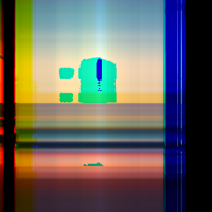

# Сингулярное разложение и сжатие изображений

Сжатие и восстановление производилось четырьмя способами.

Условия эксперимента: размер промежуточного представления в два раза меньше исходного изображения,при сжатии параметр k 
изменяется динамически, в зависимости от того, какой размер картинки и во сколько раз необходимо сжать изображение.
    

    -numpy method:

    
    

    
    

    - Power method: 

    
    

    
    

    - Householder method: 

    
    

    
    

    - Jacobi method:

    
    

    
    

В файлике image_processing_times содержится информация о времени работы каждого из алгоритмов на различных изображениях.
Посмотрев этот файл, и результаты после разжатия картинок, можно прийти к следующим результатам:
    Самый быстрый из всех алгоритмов - это библиотечный(из numpy).
    Метод Хаусхолдера проигрывает алгоритму из numpy, время его работы значительно больше, при этом качество после разжатия не уступает библиотечному.
    Самый плохой, но не самой медленной из всех реализаций оказался метод Якоби.
    Качество разжатого изображения содержит существенно меньше черт, характерных исходному изображению, по 
    сравнению с методами, описанными выше.
    Самым медленным алгоритмом можно назвать power метод, но в свою очередь он позволяет хорошо сохранить черты исходного
    изображения после разжатия, на уровне алгоритма из numpy, и метода Хаусхолдера.

В ходе реализации были использованы следующие источники:

https://www.grad.hr/nastava/gs/prg/NumericalRecipesinC.pdf

https://drsfenner.org/blog/2016/03/svd-computation-capstone/

https://www.jeremykun.com/2016/05/16/singular-value-decomposition-part-2-theorem-proof-algorithm/