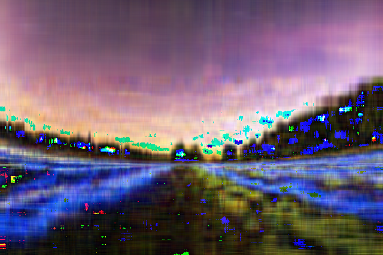

# Сингулярное разложение и сжатие изображений

Сжатие и восстановление производилось четырьмя способами.

Условия эксперимента: размер промежуточного представления в два раза меньше исходного изображения,при сжатии параметр k 
изменяется динамически, в зависимости от того, какой размер картинки и во сколько раз необходимо сжать изображение.
    

    -numpy method:

    
    

    
    

    - Power method: 

    
    

    
    

    - Householder method: 

    
    

    
    

    - Jacobi method:

    
    

    
    

Из трёх методов сжатия изображений особенно хорошо показал себя метод Хаусхолдера. Он позволяет сравнительно быстро сжать
изображение, не уступая в качестве библиотеке numpy на представленных изображениях. Power метод не уступает алгоритму 
Хаусхолдера в качестве, хоть и является примитивным, но сингулярное разложение он строит гораздо дольше. Самая плохая
реализация получилась с методом Якоби. Он гораздо медленнее приближает, и качество восстановленного изображения после
сжатия оставляет желать лучшего.

В ходе реализации были использованы следующие источники:

https://www.grad.hr/nastava/gs/prg/NumericalRecipesinC.pdf

https://drsfenner.org/blog/2016/03/svd-computation-capstone/